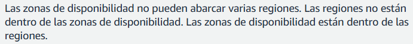

# Introducción a Consola de Administración de AWS

- La consola permite flexibilidad en personalizar vistas y configuraciones.
- La consola se usa para administrar y supervisar las cuentas de AWS.

## Los objetivos:

- Describir el propósito de la Consola de administración de AWS.
- Navegar por las funciones de la Consola de administración de AWS.
- Describir la estructura de la infraestructura global de AWS.
- Identificar modelos de pago de AWS y los factores relacionados a los costos de los servicios.

---

## Zonas de disponibilidad

- *Región:* Área geográfica donde contiene varios centros de datos (ejemplo: us-east-1).
- *Zonas de disponibilidad:* Subconjunto dentro de una región (ejemplo: us-east-1a, us-east-1a).
- *Ubicación de borge:* Centro de datos pequeños, principalmente para servicios de entrega de contenido (Amazon CloudFront), DNS (Route 53) y servicios de baja latencia. Está más cerca del usuario final que las regiones. 

## Modelos de pago de AWS

- Pago por uso.
- Ahorrar cuando se compromete.
- Paga menos usando más.
- Los precios varían según la región y los servicios.

---

### Preguntas:

+ ¿Qué es una región en AWS?

+ Qué sucede cuando se detiene una instancia de EC2?

+ ¿Qué se entiende sobre las regiones y las zonas de disponibilidad?

+ Si se inicia una instancia de Amazon EC2 de alto rendimiento. Esta instancia durará al menos 1 año. Descubre que AWS ofrece un plan de ahorros de EC2 para un proyecto de al menos 1 año. ¿A qué tipo de modelo de precios pertenece?

+ Se iniciará una instancia de EC2 para hacer una prueba. Continuará haciendo la prueba por curso de 6 meses. Detendrá la instancia al final del día para ahorrar costos. ¿A qué tipo de modelo de precios pertenece este ejemplo?

+ El nivel gratuito de AWS ofrece tres maneras para ayudarlo a ahorrar dinero. ¿Cuáles son los tres tipos de niveles de uso gratuito?

+ ¿Cómo puede ver en qué regiones tiene instancias de Amazon EC2?

+ ¿Cuál es la práctica recomendada para minimizar costos?

